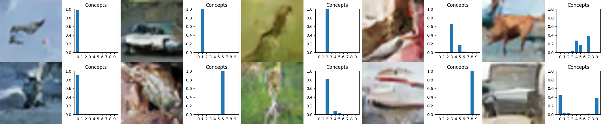
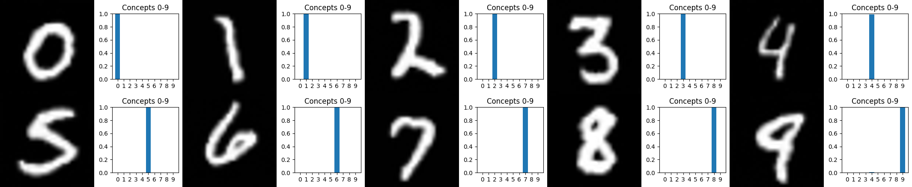
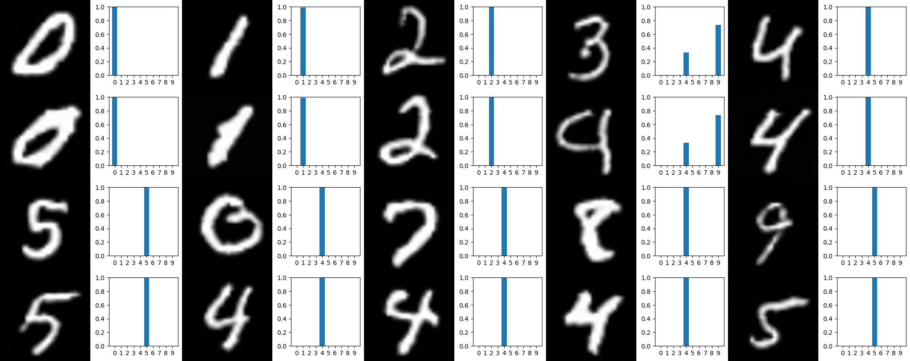
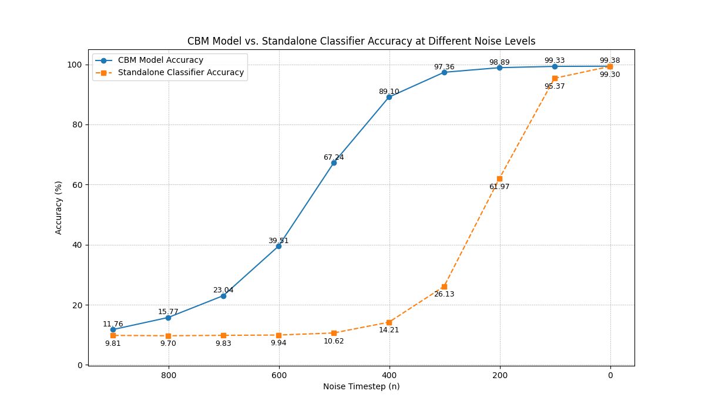
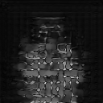

# C-VCE and L-DVCE on CelebA

This repository contains the code used to train diffusion-based counterfactual models on CelebA, generate counterfactual images, and evaluate them with validity, proximity, identity, and distributional metrics.

---

## About This Project

**ex_diffuser** is a research project exploring **diffusion-model-based visual counterfactual explanations** for facial attribute editing.

> **What does that mean in plain language?**
> Given a face image, the model answers the question: *"What would this person look like if they had a different attribute (e.g., were younger, or were smiling)?"*
> The generated image should be as close as possible to the original, while flipping the target attribute — making it a **counterfactual explanation**.

Two methods are implemented and compared:

| Method | Description |
|--------|-------------|
| **C-VCE** | Concept-based Visual Counterfactual Explanation — a diffusion model trained with concept-aware guidance using a Concept Bottleneck Module (CBM). |
| **L-DVCE** | Latent Diffusion Visual Counterfactual Explanation (Baseline) — standard DVCE guidance applied in the latent diffusion space without concept bottleneck. |

Both methods operate on the **CelebA** dataset and target binary facial attributes (e.g., *Smiling*, *Young*). The quality of the generated counterfactuals is measured with:

- **Flip rate** — does the generated image have the desired attribute?
- **Proximity** (L1 / L2 / L1.5) — how close is the counterfactual to the original?
- **Identity similarity** (DeepFace) — does the generated image preserve the person's identity?
- **sFID** — is the generated distribution realistic?

---

## Experiment Results

### Counterfactual Generation Examples

The following grid shows original images (left) alongside their counterfactual versions generated by C-VCE and the baseline:



---

### First Generation — Interventions 0 to 9



---

### C-VCE vs Baseline Comparison

Comparison of generated images with concept-guided (C-VCE) and zeroed-concept (baseline) interventions:



---

### Classifier Accuracy Across Noise Levels

Classifier accuracy at different diffusion noise levels, used to select the optimal intervention point:



---

### Guidance Gradient Visualizations

These animations visualize the classifier guidance gradients driving the diffusion process towards the target attribute:

| Guidance Gradients | Distance Masks | Concept Masks |
|:------------------:|:--------------:|:-------------:|
|  |  |  |

---

## 1. Project overview

The pipeline has 3 stages:

1. **Train models**
   - Train the baseline diffusion model
   - Train the C-VCE diffusion model
   - Train the latent classifier used for guidance/evaluation

2. **Generate counterfactuals**
   - Run the final experiment scripts
   - Save original, C-VCE, and baseline generations

3. **Evaluate**
   - Compute flip rate, proximity, DeepFace, and sFID
   - Aggregate CSV results
   - Produce plots/tables

---

## 2. Repository structure

```text
ex_diffuser/
├── classifier/
├── configs/
├── data/
├── experiments/
├── models/
└── cluster_evaluation/
    ├── generate_final.py
    ├── generate_counterfactuals.py
    ├── master_evaluation.py
    ├── master_evaluation_corollation.py
    ├── plots.py
    ├── ploy_final_ee.py
    ├── table.py
    └── ...
```

---

## 3. Requirements

- Linux
- Python 3.10+
- NVIDIA GPU recommended
- CUDA-enabled PyTorch
- TensorFlow is only needed by `DeepFace`

Install system dependencies if needed:

```bash
sudo apt update
sudo apt install -y python3-venv python3-pip
```

Create a virtual environment:

```bash
cd /home/oueslatiy/MasterThesis/ex_diffuser
python3 -m venv .venv
source .venv/bin/activate
pip install --upgrade pip
```

Install Python dependencies:

```bash
pip install torch torchvision torchaudio
pip install diffusers transformers accelerate safetensors
pip install pillow tqdm matplotlib pandas numpy scipy scikit-learn
pip install torchmetrics
pip install deepface tensorflow
pip install opencv-python
pip install huggingface_hub
```

If your project already has a requirements file, use that instead:

```bash
pip install -r requirements.txt
```

---

## 4. Dataset setup

Prepare CelebA locally.

Expected paths used by the current scripts:

```text
/home/oueslatiy/data/celeba/images
/home/oueslatiy/data/celeba/list_attr_celeba.txt
```

If your dataset is elsewhere, update these variables in the generation/evaluation scripts:

- `IMAGE_DIR`
- `ATTR_PATH`

Files currently using hardcoded paths include:

- `cluster_evaluation/generate_final.py`
- `cluster_evaluation/generate_counterfactuals.py`
- `cluster_evaluation/master_evaluation.py`

---

## 5. Checkpoint locations

The current code expects checkpoints such as:

```text
/home/oueslatiy/MasterThesis/ex_diffuser/experiments/CelebA/concept_model_noCBM_299.pt
/home/oueslatiy/MasterThesis/ex_diffuser/experiments/CelebA/concept_model_wandb_299.pt
/home/oueslatiy/MasterThesis/ex_diffuser/experiments/CelebA/classifier_celeba_final_best.pt
```

If training from scratch, place produced checkpoints in:

```text
experiments/CelebA/
```

or update the checkpoint paths inside the scripts.

---

## 6. Training

## 6.1 Train the baseline diffusion model

Run the baseline training script:

```bash
python [BASELINE_TRAIN_SCRIPT].py
```

Expected output checkpoint:

```text
experiments/CelebA/concept_model_noCBM_299.pt
```

## 6.2 Train the C-VCE diffusion model

Run the concept-aware diffusion training script:

```bash
python [CVCE_TRAIN_SCRIPT].py
```

Expected output checkpoint:

```text
experiments/CelebA/concept_model_wandb_299.pt
```

## 6.3 Train the latent classifier

Run the classifier training script:

```bash
python [CLASSIFIER_TRAIN_SCRIPT].py
```

Expected output checkpoint:

```text
experiments/CelebA/classifier_celeba_final_best.pt
```

> Replace:
>
> - `[BASELINE_TRAIN_SCRIPT]`
> - `[CVCE_TRAIN_SCRIPT]`
> - `[CLASSIFIER_TRAIN_SCRIPT]`
>
> with your actual training entry files.

---

## 7. Run the final experiments

After training, generate the final experiment outputs.

### 7.1 Generate counterfactuals

Main script:

```bash
python cluster_evaluation/generate_final.py
```

Alternative generation script:

```bash
python cluster_evaluation/generate_counterfactuals.py
```

The final experiment configuration in `generate_final.py` currently uses:

- **Baseline / L-DVCE**
  - `noise_start = 200`
  - `intervention_strength = 0.04`
  - `distance_strength = 0.15`

- **C-VCE**
  - `noise_start = 200`
  - `noise_end = 202`
  - `intervention_strength = 1`
  - `w = 4.0`

The broader hyperparameter sweeps explored were:

- **Baseline DVCE**: `C_c` from **0.03 to 0.1**
- **C-VCE**: `w` from **1 to 5**

Generated images are saved under folders such as:

```text
cluster_evaluation/Smiling_final/
cluster_evaluation/Smiling_final_1/
cluster_evaluation/Smiling_final_2/
cluster_evaluation/Smiling_final_3/
cluster_evaluation/Smiling_final_4/
cluster_evaluation/Young_final/
cluster_evaluation/Young_final_1/
cluster_evaluation/Young_final_2/
cluster_evaluation/Young_final_3/
cluster_evaluation/Young_final_4/
```

Each experiment folder typically contains:

```text
images_real/
images_cbm/
images_baseline/
```

---

## 8. Run evaluation

Evaluate the generated images with all metrics:

```bash
python cluster_evaluation/master_evaluation.py
```

This script computes:

- flip rate
- proximity (`L1`, `L2`, `L1.5`)
- DeepFace identity similarity
- sFID

Then collate or merge results if needed:

```bash
python cluster_evaluation/master_evaluation_corollation.py
python cluster_evaluation/merge_res.py
```

Example result files:

```text
cluster_evaluation/master_evaluation_results_FINAL_test_std.csv
cluster_evaluation/master_evaluation_results_FINAL.csv
cluster_evaluation/master_evaluation_CORR.csv
```

---

## 9. Plotting and tables

To reproduce figures and summary visualizations:

```bash
python cluster_evaluation/plots.py
python cluster_evaluation/ploy_final_ee.py
python cluster_evaluation/table.py
```

These scripts were used to compare the different hyperparameter settings and final selected models.

---

## 10. Recommended execution order

Run everything in this order:

### Step 1: activate environment

```bash
cd /home/oueslatiy/MasterThesis/ex_diffuser
source .venv/bin/activate
```

### Step 2: train all models

```bash
python [BASELINE_TRAIN_SCRIPT].py
python [CVCE_TRAIN_SCRIPT].py
python [CLASSIFIER_TRAIN_SCRIPT].py
```

### Step 3: generate experiment images

```bash
python cluster_evaluation/generate_final.py
```

### Step 4: evaluate results

```bash
python cluster_evaluation/master_evaluation.py
python cluster_evaluation/master_evaluation_corollation.py
```

### Step 5: produce plots/tables

```bash
python cluster_evaluation/plots.py
python cluster_evaluation/ploy_final_ee.py
python cluster_evaluation/table.py
```

---

## 11. Notes

- Many scripts use **absolute paths**. Update them before running on another machine.
- A GPU is strongly recommended.
- `DeepFace` may use TensorFlow and can be slower on CPU.
- If CUDA/TensorFlow conflicts appear, check the environment variables already used inside `master_evaluation.py`.

---

## 12. Reproducibility

Main final settings used in the reported experiments:

- **Baseline DVCE**
  - `noise_start = 200`
  - `C_c = 0.04`
  - `C_d = 0.15`

- **C-VCE**
  - `noise_start = 200`
  - `noise_end = 202`
  - `w = 4.0`
  - `intervention_strength = 1`

Explored but not all reported:

- **DVCE**: `C_c ∈ [0.03, 0.1]`
- **C-VCE**: `w ∈ [1, 5]`

---

## 13. If checkpoints already exist

If the three checkpoints are already present, training can be skipped and only the following commands are needed:

```bash
python cluster_evaluation/generate_final.py
python cluster_evaluation/master_evaluation.py
python cluster_evaluation/master_evaluation_corollation.py
python cluster_evaluation/plots.py
python cluster_evaluation/ploy_final_ee.py
python cluster_evaluation/table.py
```